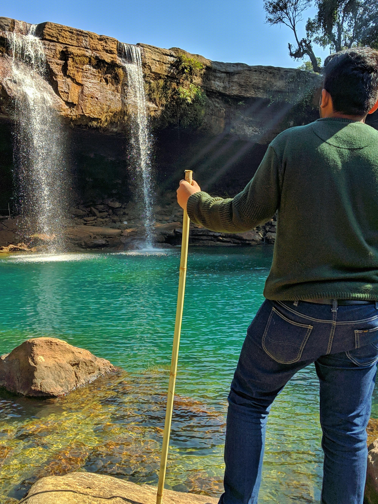
<figcaption class="caption">Fall's'</figcaption>

    

        
        <figcaption class="caption">Photo with my mom and dad when I was 8 months old, at Puri Beach,India</figcaption>
    

    

    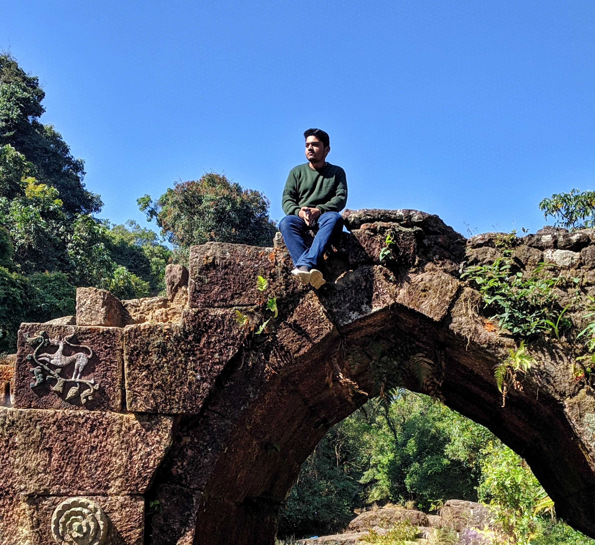
    <figcaption class="caption">Photo with my mom and dad when I was 8 months old, at Puri Beach,India</figcaption>
    

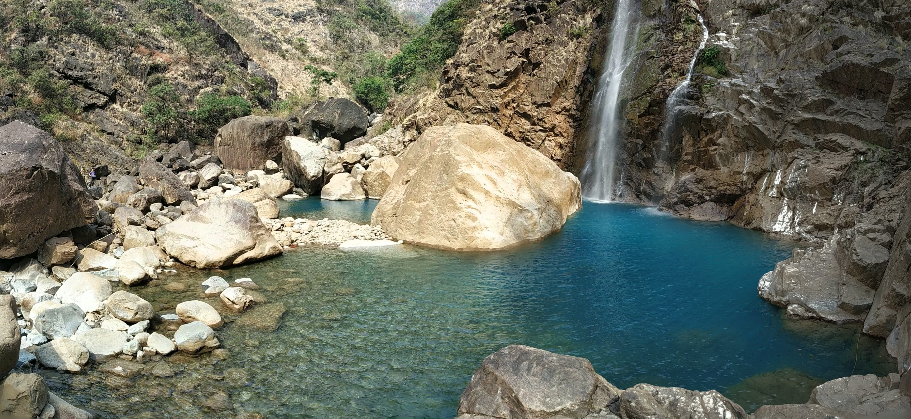
<figcaption class="caption">Fall's'</figcaption>

    

    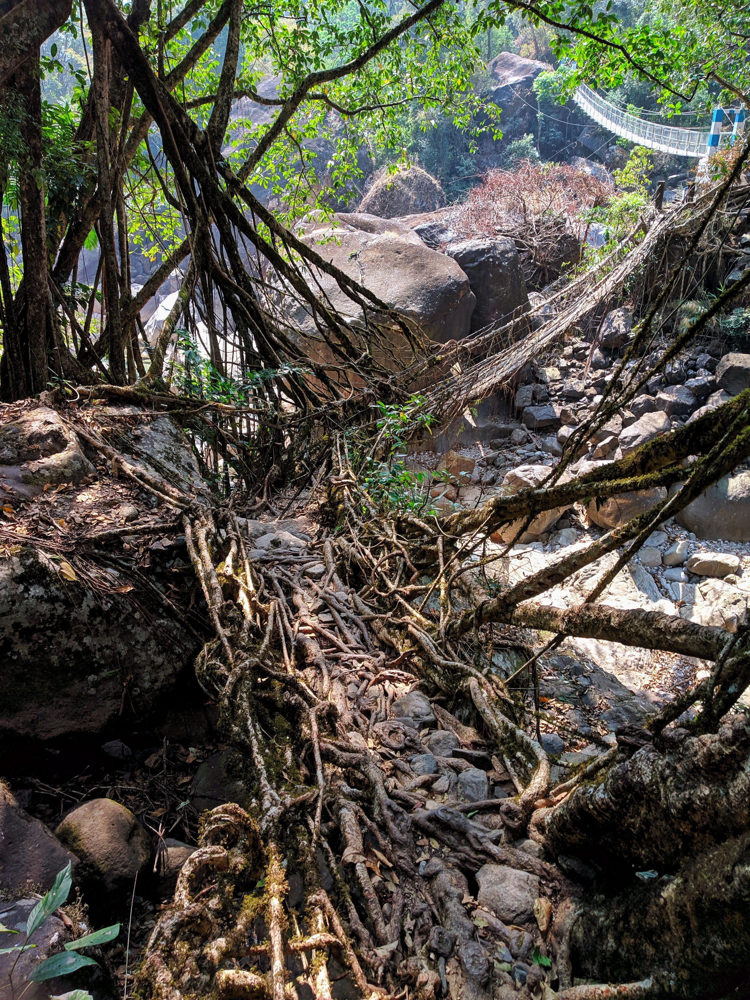
    <figcaption class="caption">Photo of me with my Maa, at Indian border with Nepal</figcaption>
    

    

        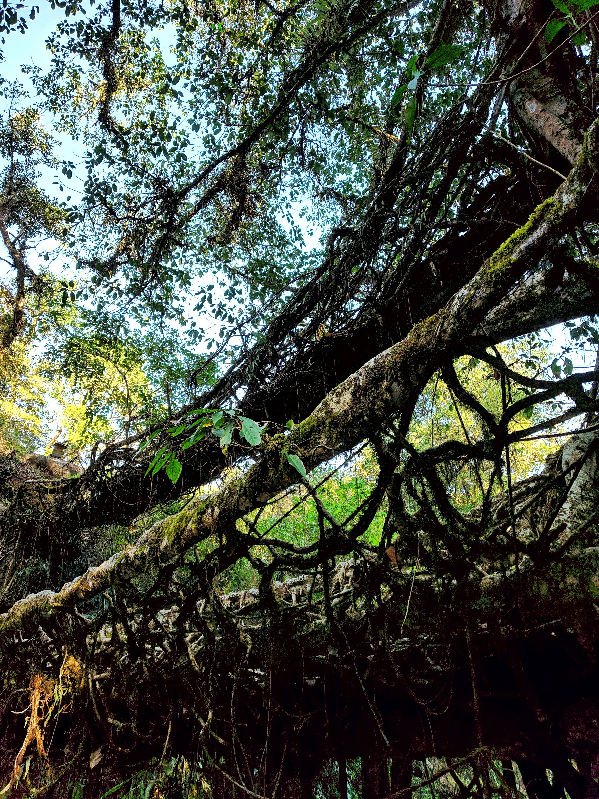
        <figcaption class="caption">Photo of me with my Maa, at Indian border with Nepal</figcaption>
    

    

    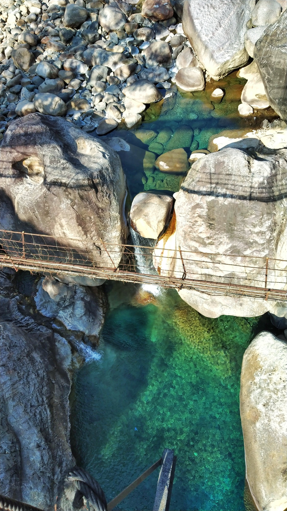
    <figcaption class="caption">Photo of me with my Maa, at Indian border with Nepal</figcaption>
    

    

        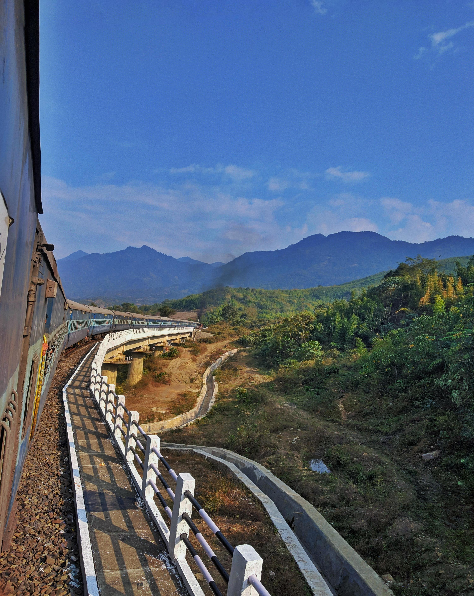
        <figcaption class="caption">Photo of me with my Maa, at Indian border with Nepal</figcaption>
    

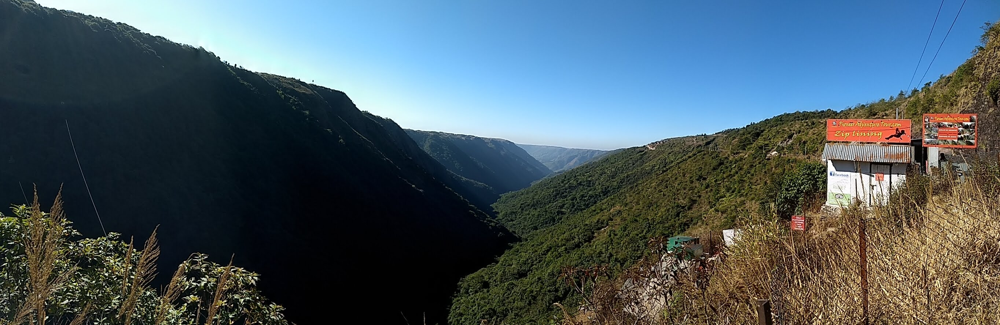
<figcaption class="caption">Y-shaped-Valley</figcaption>

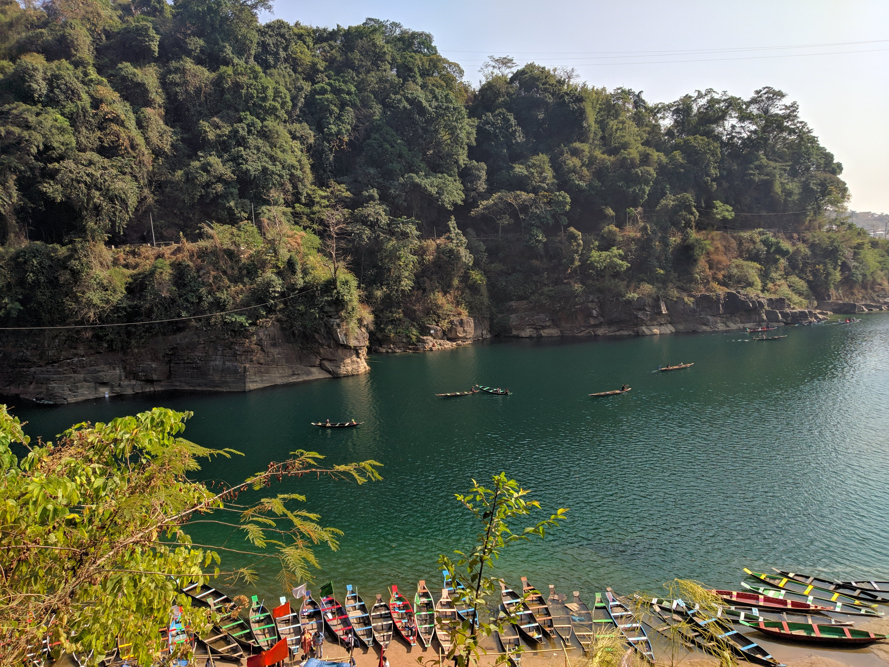
<figcaption class="caption">Dawki</figcaption>

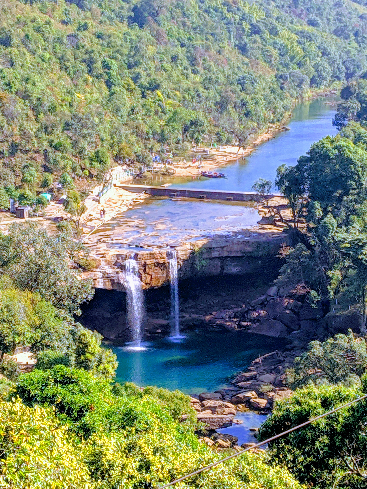
<figcaption class="caption">Fall</figcaption>

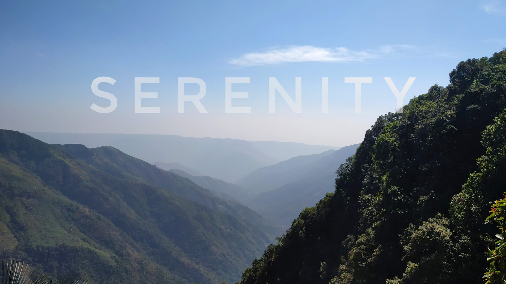
<figcaption class="caption">Fall</figcaption>
