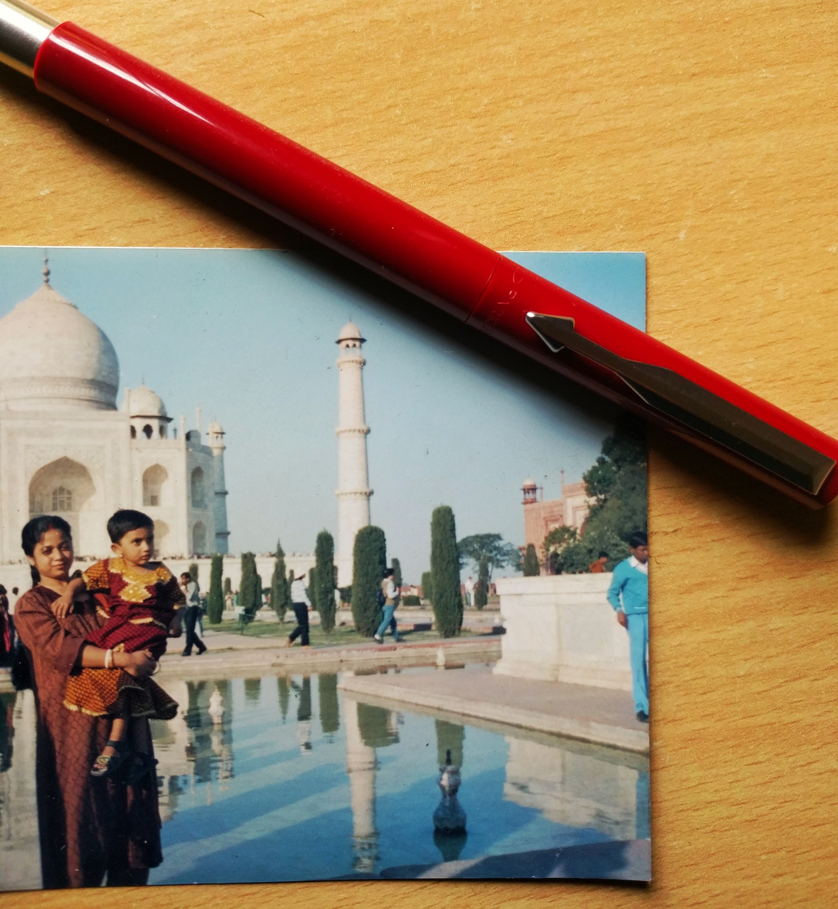
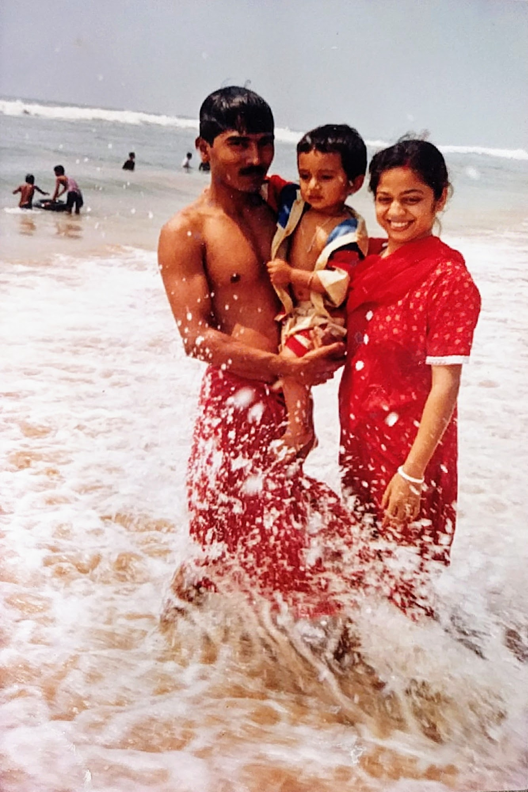
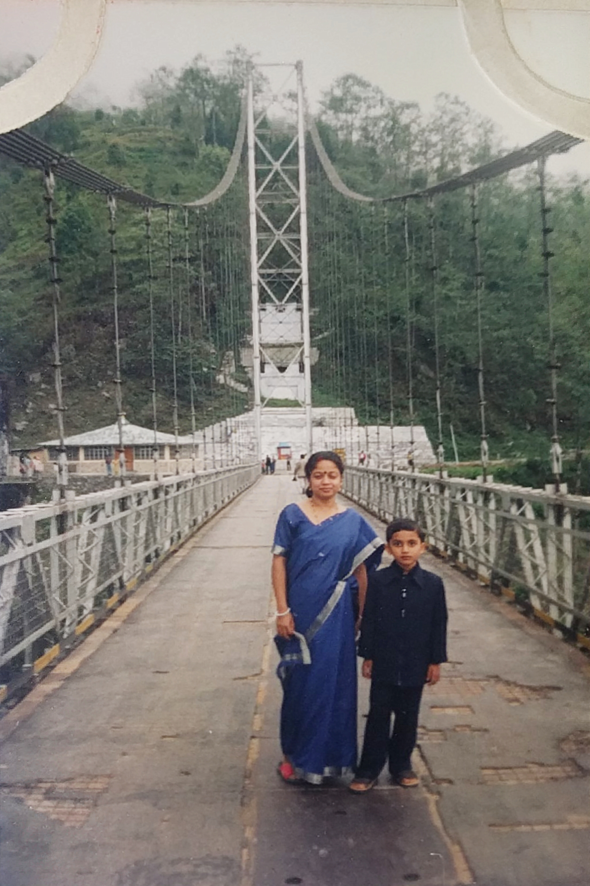
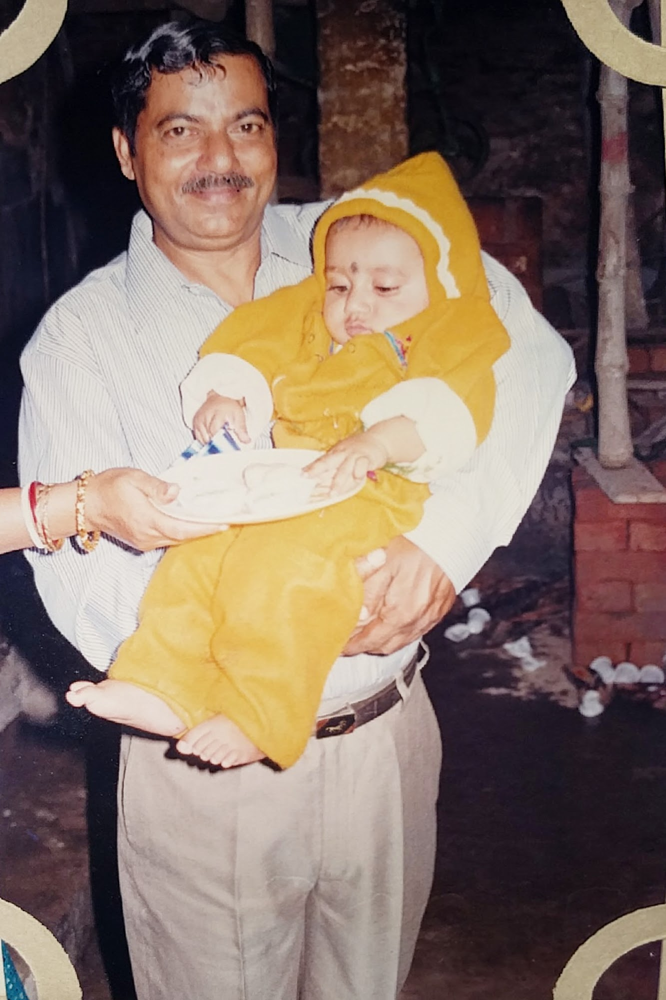
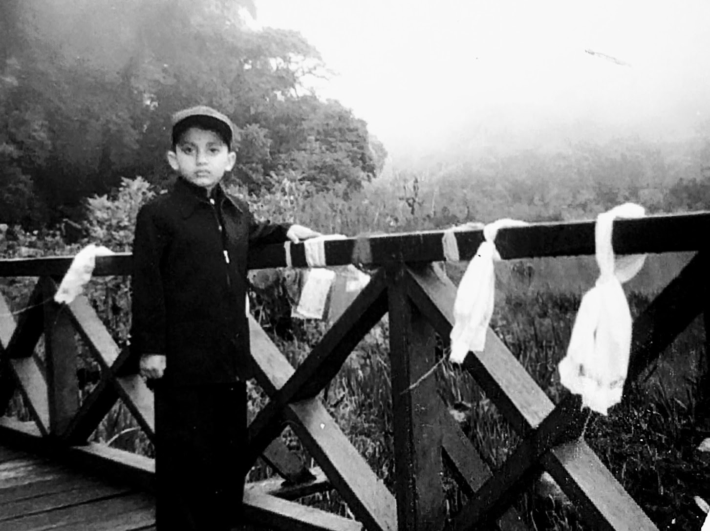
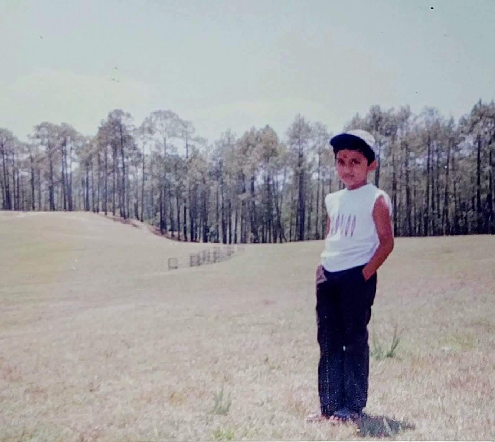
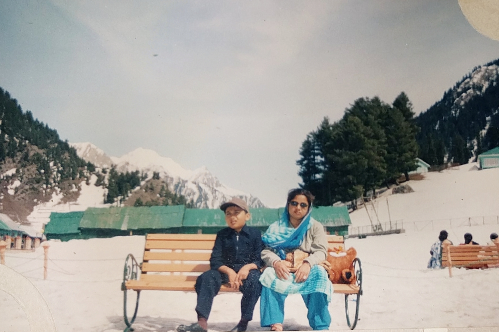

<h3>This blog is to paint the memeories with my parents.</h3>

<figcaption class="caption">Dad made me wear Ghagra(traditional Indian girl's dress)🤦🏻‍♂️</figcaption>

    

        
        <figcaption class="caption">Photo with my mom and dad when I was 8 months old, at Puri Beach,India</figcaption>
    

    

        
I am the only clid, born to lower-middle class society of India. Inspite of which my parents worked hard to raise me, leave no stones unturned for their son's comfort and growth; which also includes travels. As my father has made me believe traveling has is a huge part of overall personality growth and also helps on shaping a persons tastes to life.

    

    

        
Lorem ipsum dolor sit amet, consectetur adipisicing elit, sed do eiusmod tempor incididunt ut labore et dolore magna aliqua. Ut enim ad minim veniam, quis nostrud exercitation ullamco laboris nisi ut aliquip ex ea commodo consequat. Duis aute irure dolor in reprehenderit in voluptate velit esse cillum dolore eu fugiat nulla pariatur. Excepteur sint occaecat cupidatat non proident, sunt in culpa qui officia deserunt mollit anim id est laborum.

    

    

        
        <figcaption class="caption">Photo of me with my Maa, at Indian border with Nepal</figcaption>
    

    

        
        <figcaption class="caption">Me in my Grandpa's arms👶🏻</figcaption>
    

    

        
Lorem ipsum dolor sit amet, consectetur adipisicing elit, sed do eiusmod tempor incididunt ut labore et dolore magna aliqua. Ut enim ad minim veniam, quis nostrud exercitation ullamco laboris nisi ut aliquip ex ea commodo consequat. Duis aute irure dolor in reprehenderit in voluptate velit esse cillum dolore eu fugiat nulla pariatur. Excepteur sint occaecat cupidatat non proident, sunt in culpa qui officia deserunt mollit anim id est laborum.

    

    

        
Lorem ipsum dolor sit amet, consectetur adipisicing elit, sed do eiusmod tempor incididunt ut labore et dolore magna aliqua. Ut enim ad minim veniam, quis nostrud exercitation ullamco laboris nisi ut aliquip ex ea commodo consequat. Duis aute irure dolor in reprehenderit in voluptate velit esse cillum dolore eu fugiat nulla pariatur. Excepteur sint occaecat cupidatat non proident, sunt in culpa qui officia deserunt mollit anim id est laborum.

    

    

        
        <figcaption class="caption">Some monestry I dont remember</figcaption>
    

    

    
    <figcaption class="caption">Some monestry I dont remember</figcaption>
    

    

        
        <figcaption class="caption">Somewhere in Gulmarg, Kashmir, India</figcaption>
    

