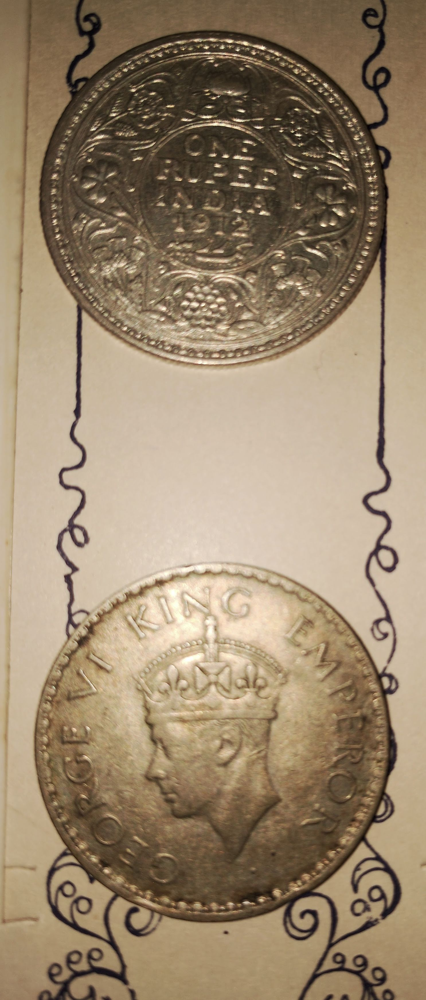
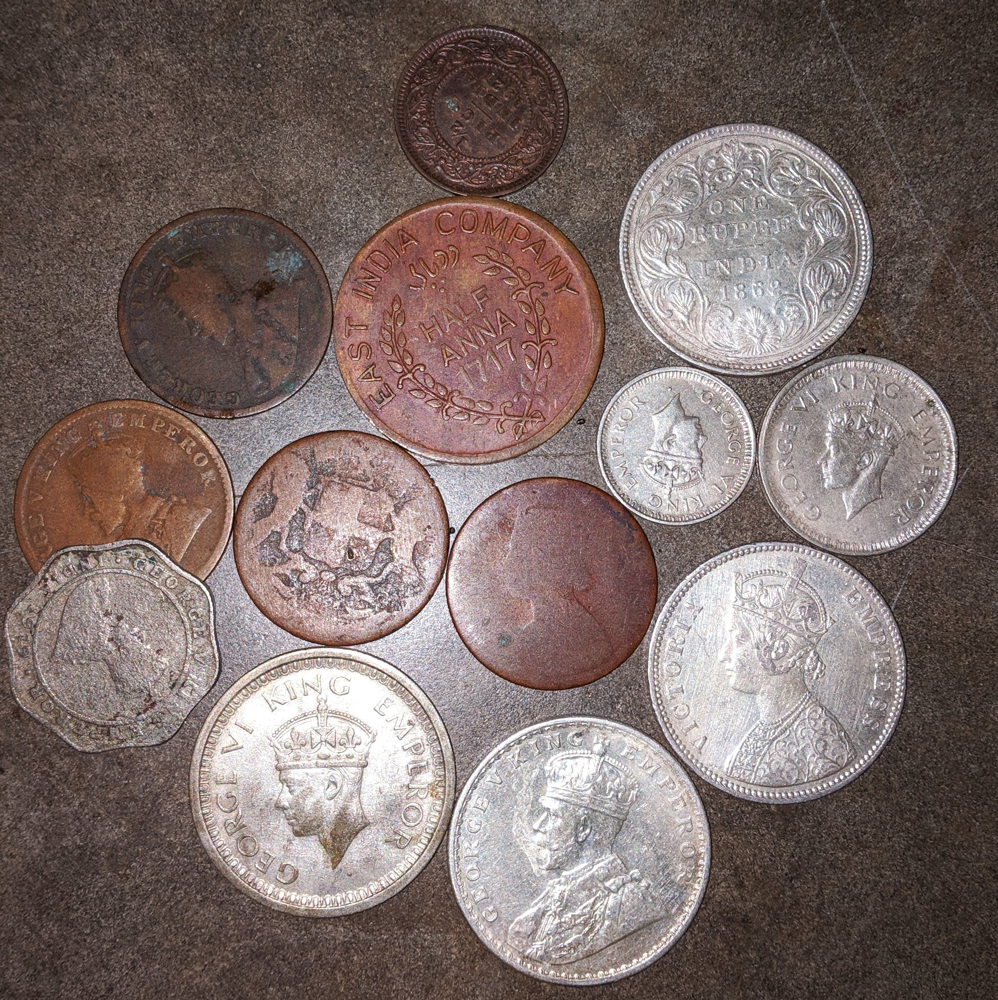
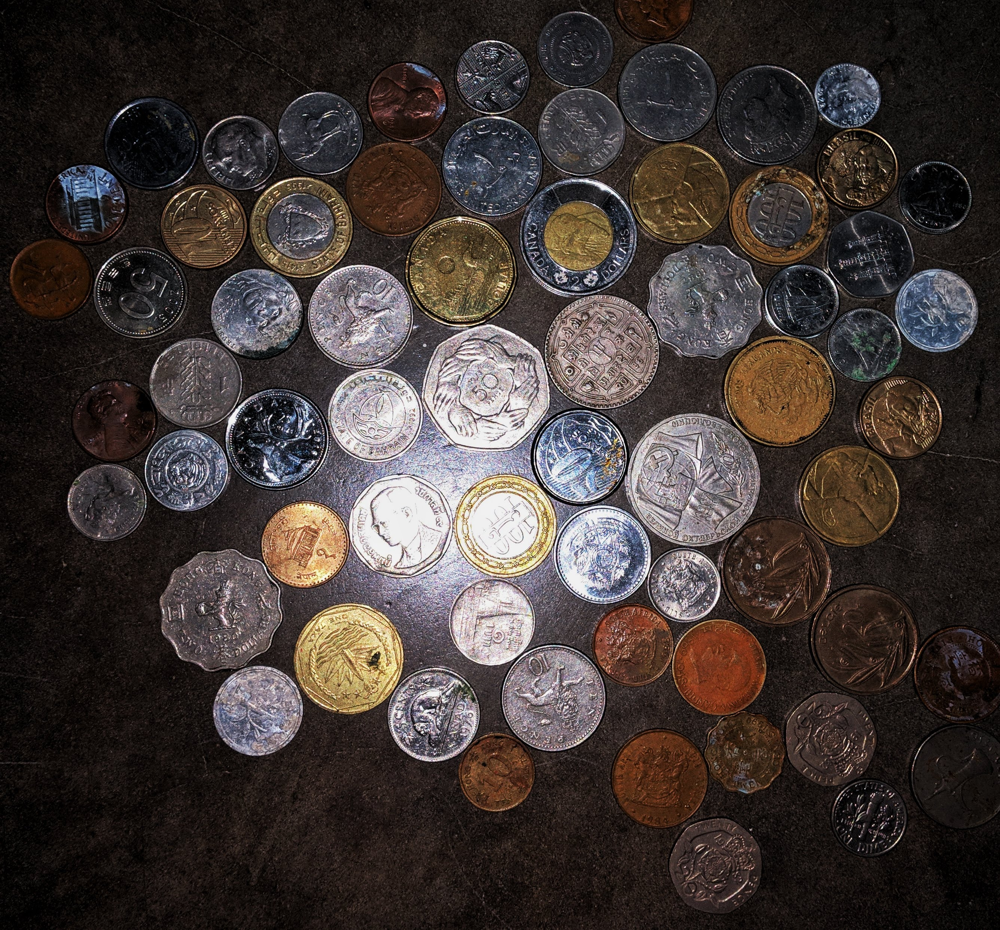

<figcaption class="caption">East India Company-coins-1</figcaption>

Passed on by my father to collect unique coins, grew into an arcane hobby.
All the coins collected has been collected from Pron shops or from jewellery shops, where they had been left off to be incenerated to metal values.

    

      
    

    

        
asdasdLorem ipsum dolor sit amet, consectetur adipisicing elit, sed do eiusmod tempor incididunt ut labore et dolore magna aliqua. Ut enim ad minim veniam, quis nostrud exercitation ullamco laboris nisi ut aliquip ex ea commodo consequat. Duis aute irure dolor in reprehenderit in voluptate velit esse cillum dolore eu fugiat nulla pariatur. Excepteur sint occaecat cupidatat non proident, sunt in culpa qui officia deserunt mollit anim id est laborum.
        

    

<figcaption class="caption">50%(the whole collection)</figcaption>
