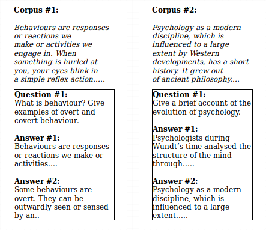

While conducting literature research on the <a href='https://glitch401.github.io/Automated-Question-Answering/'>automatic subjective question answering</a>. We had come across a plethora of datasets available for the task of Question Answering. Still, none exactly sufficed my needs--all of the datasets available were either a task-specific one or constructed from knowledge base condensed from all over the internet. Namely:  <a href="https://rajpurkar.github.io/SQuAD-explorer/explore/v2.0/dev/" target='_blank'>SQuAD</a>, <a href="http://www.msmarco.org/" target='_blank'>MS MACRO</a>, <a href="https://homes.cs.washington.edu/ eunsol/papers/acl17jcwz.pdf" target='_blank'>TriviaQA</a>, <a href="https://homes.cs.washington.edu/ eunsol/papers/acl17jcwz.pdf" target='_blank'>NewsQA</a> <a href='https://aclweb.org/anthology/Q18-1023' target='_blank'>NarrativeQA</a>. Hence, we could only see it as a cardinal step to approach our ultimate goal of creating an  <a href='https://glitch401.github.io/Automated-Question-Answering/'>automatic subjective question answering</a>, which is purely focused on answering topics from academia.  

<figcaption class="caption">Dataset Structute</figcaption>

 
It took us an approximate of two months to fully develop the dataset. A sample of its structure can be seen, as above.
It consists of text corpus:extracted from <a href='http://ncert.nic.in/'>NCERT</a> and question-answer pairs relevant to the content of each page. The question-answer pair consists of a single question accompanied with five different answers. Which were extracted through the web crawlers we have build primarily using <a href='https://www.crummy.com/software/BeautifulSoup/bs4/doc/'>BeautifulSoup</a>.
  
Note: This dataset has not yet been released for public usage. But will soon be, as soon as we fulfill our objective to build this dataset. (More details about this dataset will soon be released)

